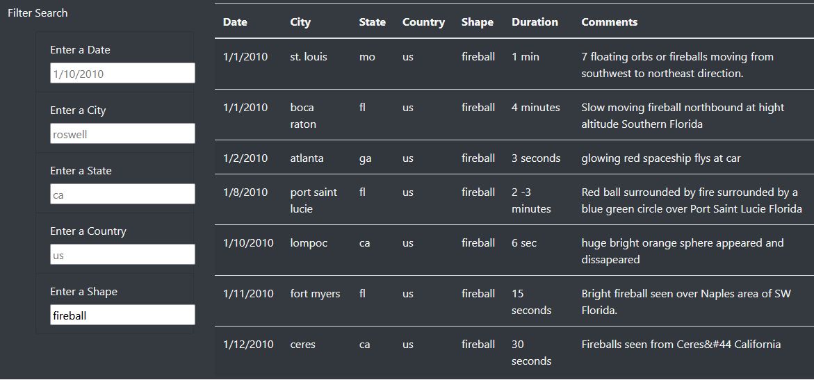

# UFO Sightings

The finished webpage is hosted [here](https://e-pluribus-datum.github.io/UFOs/) via GitHub Pages.

## Overview

This project used HTML, CSS, JavaScript, and Bootstrap to build a dynamic webpage that filtered table data on UFO sightings. Javascript was used to write functions to load the data from a .js file as well as update the displayed data according to user text input.

## Results

The input forms on the left will update the table on the right by filtering the data. Only exact matches are shown. For any fields left blank, the table will not filter those columns and will suggest the format for the text input.

## Summary

One limitation of this design is that matches must be exact. Allowing matches to be contained in the entry, such as being able to search all cities containing "Fort", would improve the end user's ability to search through the data. Additionally, some care must be taken in the color scheme of the text suggested by blank input fields. More contrast between the gray of suggested text and the black of user-inputted text would make it more obvious that the suggested entries are not filtering the table.